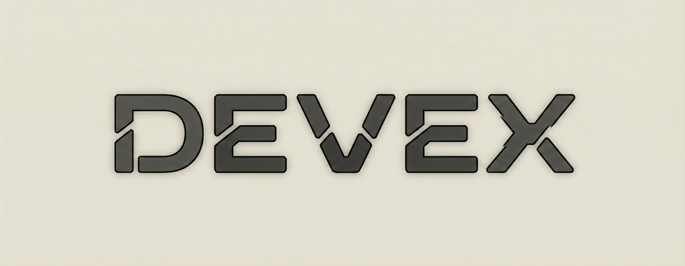

# Devex

A lightweight, zero-heavy-dependency Ruby CLI providing a unified `dx` command for common development tasks. Projects can extend with local tasks. Clean-room implementation inspired by toys-core patterns.

## Vision

- **Single entry point**: `dx` command for all dev tasks
- **Zero-dependency core**: Support library uses only Ruby stdlib
- **Project-local tools**: Override or extend built-ins with `tools/*.rb`
- **Agent-aware**: Automatically detects AI agent invocation and adapts output
- **Environment-aware**: Rails-style environment detection (dev/test/staging/prod)
- **Command execution**: Clean subprocess management with environment orchestration

## Installation

```bash
gem install devex
```

Or add to your Gemfile:

```ruby
gem "devex"
```

## Usage

```bash
# Show available commands
dx help

# Show/manage version
dx version
dx version bump patch
dx version set 2.0.0

# With JSON output (auto-detected in agent mode)
dx version --format=json
```

## Project-Local Tools

Create a `tools/` directory in your project root with Ruby files:

```ruby
# tools/deploy.rb
desc "Deploy to production"
flag :dry_run, "-n", "--dry-run", desc: "Show what would be deployed"

include Devex::Exec

def run
  if dry_run
    $stdout.puts "Would deploy..."
  else
    run("./scripts/deploy.sh").exit_on_failure!
  end
end
```

Then run: `dx deploy` or `dx deploy --dry-run`

### Nested Tools

```ruby
# tools/db.rb
desc "Database operations"

tool "migrate" do
  desc "Run migrations"
  def run
    # ...
  end
end

tool "seed" do
  desc "Seed the database"
  def run
    # ...
  end
end
```

Access as: `dx db migrate`, `dx db seed`

## Configuration

Create `.devex.yml` in your project root:

```yaml
# Custom tools directory (default: tools)
tools_dir: dev/tools
```

## Global Options

```bash
dx --help                    # Show help with global options
dx --dx-version              # Show devex gem version
dx -f json version           # Output in JSON format
dx --format=yaml version     # Output in YAML format
dx -v version                # Verbose mode
dx -q version                # Quiet mode
dx --no-color version        # Disable colors
dx --color=always version    # Force colors
```

## Environment Variables

- `DX_ENV` / `DEVEX_ENV` - Set environment (development, test, staging, production)
- `DX_AGENT_MODE=1` - Force agent mode (structured output, no colors)
- `DX_INTERACTIVE=1` - Force interactive mode
- `NO_COLOR=1` - Disable colored output
- `FORCE_COLOR=1` - Force colored output

## Debug Flags

Hidden flags for testing and bug reproduction (not shown in `--help`):

```bash
dx --dx-agent-mode version      # Force agent mode
dx --dx-no-agent-mode version   # Force interactive mode
dx --dx-env=production version  # Force environment
dx --dx-terminal version        # Force terminal detection
```

## Built-in Commands

- `dx version` - Show project version
- `dx version bump <major|minor|patch>` - Bump semantic version
- `dx version set <version>` - Set explicit version

More built-ins planned: `test`, `lint`, `format`, `types`, `pre-commit`, `gem`

## Development

```bash
bundle install
bundle exec rake test
bundle exec exe/dx --help
```

## Documentation

- **[Developing Tools](docs/developing-tools.md)** - How to create tools, available interfaces, best practices
- **[CLAUDE.md](CLAUDE.md)** - Architecture overview for contributors
- **[OUTLINE.md](OUTLINE.md)** - Feature comparison with toys-core and Rake

## License

MIT
